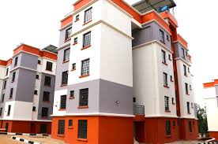

# 🏗️ AH-Building – Construction Company Website

A modern, responsive construction company website built with **React** and styled with **Tailwind CSS**.  
This project showcases the company’s services, completed projects, and an easy way for clients to book a call via WhatsApp.

---

## 🚀 Features

- **Beautiful Hero Section** – Clean, responsive landing area with a call-to-action.
- **Services Section** – Displays core construction services with descriptions.
- **Projects Showcase** – Highlights completed projects with images.
- **Contact Form** – Easy-to-use form for client inquiries.
- **WhatsApp Button** – Direct link to chat with the company.
- **Responsive Design** – Works perfectly on mobile, tablet, and desktop screens.

---

## 🛠️ Tech Stack

- **React** – Frontend framework
- **Tailwind CSS** – Styling and layout
- **React Router** – For navigation
- **Framer Motion** (optional) – Smooth animations

---

## 📷 Preview



---

## 🧑‍💻 Getting Started

Follow these steps to run the project locally:

```bash
# 1. Clone the repository
git clone https://github.com/Sam-Install/AH-Building.git

# 2. Go into the project folder
cd AH-Building

# 3. Install dependencies
npm install

# 4. Start the development server
npm run dev
